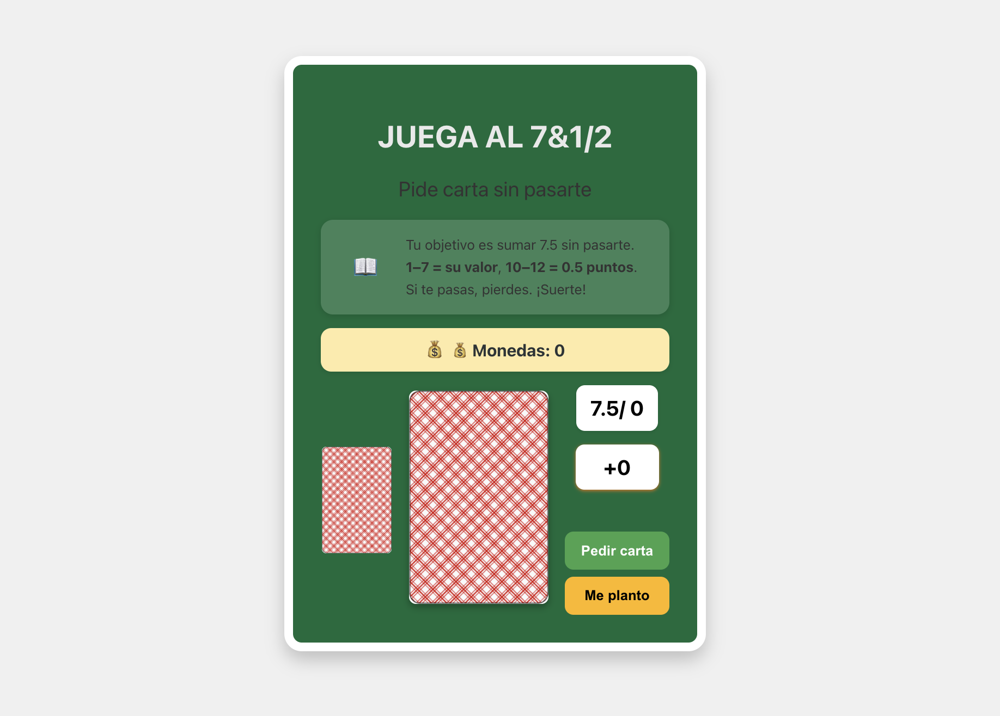
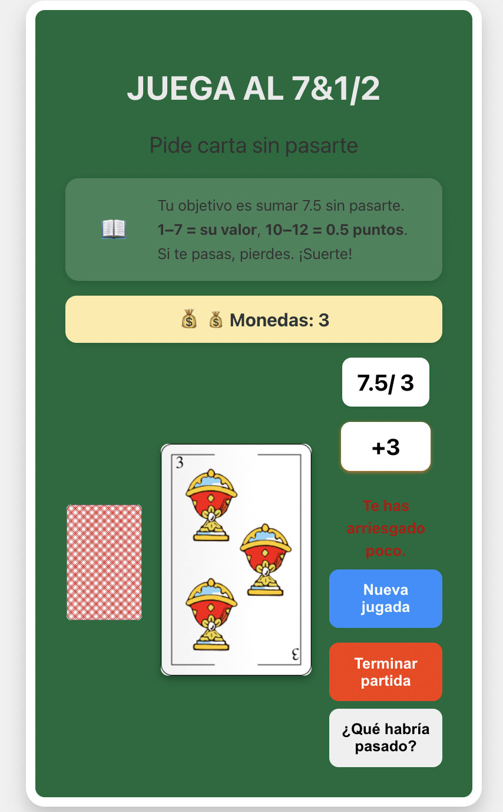
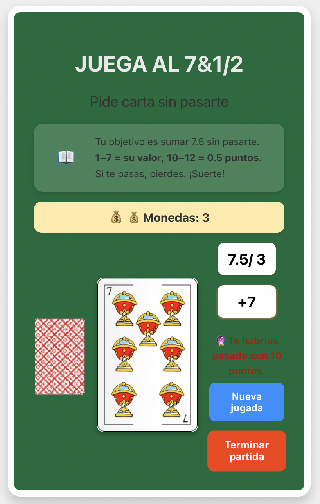

# Ejercicio 05 - Condicionales
## Juego de las Siete y Media 

Este proyecto desarrolla una aplicación web en TypeScript que simule el juego de cartas "Siete y Media" adaptado para un solo jugador. El objetivo es alcanzar una puntuación lo más cercana posible a 7,5 puntos sin pasarse. 
Además, debe tener opciones para pedir carta, plantarse, mostrar el resultado, reiniciar el juego, y opcionalmente ver qué habría pasado si seguías pidiendo.


##  Conceptos aplicados

Este laboratorio se centra en **el uso de condicionales (`if`, `else if`, `else`)** para controlar la lógica del juego en base a las decisiones del usuario y el estado del juego.

---

##  Reglas del juego

- Se juega solo con cartas del palo de **copas**.
- Las cartas valen:
  - Del 1 al 7: su valor nominal.
  - Las figuras (10=Sota, 11=Caballo, 12=Rey): **0.5 puntos**.
- Puedes pedir tantas cartas como quieras.
- Si superas los **7,5 puntos**, pierdes (Game Over).
- Puedes plantarte en cualquier momento.

---
##  Vista previa del juego

###  Pantalla inicial



###  Acción: Me planto


###  Situación: “Qué habrías pasado”


---

##  Estructura del proyecto

- **HTML** (`index.html`): Estructura básica de la interfaz del juego.
- **CSS** (`style.css`): Estilo visual con un diseño inspirado en un tapete de juego.
- **TypeScript** (`main.ts`): Lógica del juego con énfasis en condicionales.

---

##  Funcionamiento y uso de condicionales

### 1. Mostrar puntuación
- Se inicializa una variable `puntuacion = 0`.
- Se muestra en pantalla y se actualiza cada vez que se pide una carta.

```ts
if (puntuacion <= 7.5) {
  // Continúa el juego
} else {
  // Game Over
}
```

### 2. Pedir carta
- Al pulsar el botón "Pedir carta", se obtiene una carta aleatoria (1–7, 10–12).
- Se muestra la imagen correspondiente.
- Se suma su valor a la puntuación.

```ts
if (numero >= 1 && numero <= 7) {
  return numero;
} else {
  return 0.5;
}
```

### 3. Me planto
- Al plantarse, se evalúa la puntuación final con una serie de **condicionales** para mostrar un mensaje personalizado:

```ts
if (puntuacion < 4) {
  mensaje = "Has sido muy conservador.";
} else if (puntuacion === 5) {
  mensaje = "Te ha entrado el canguelo eh?";
} else if (puntuacion === 6 || puntuacion === 7) {
  mensaje = "Casi casi...";
} else if (puntuacion === 7.5) {
  mensaje = "¡Lo has clavado! ¡Enhorabuena!";
}
```

### 4. Game Over
- Si la puntuación supera 7.5, se detiene el juego y se muestra un mensaje:

```ts
if (puntuacion > 7.5) {
  mensaje = "¡Te has pasado! GAME OVER";
  // Desactiva botones
}
```

### 5. Nueva partida
- Botón "Nueva jugada" que reinicia el juego, resetea la puntuación y muestra la carta boca abajo.

---
### 6. Botón "Ver qué habría pasado'" (opcional).
- Si te plantas, aparece el botón “¿Qué habría pasado?”.
- Al pulsarlo, se revela una carta adicional y se calcula si te habrías pasado, quedado cerca o ganado.

```ts
if (totalHipotetico > 7.5) {
  mensaje = "🔮 Te habrías pasado con X puntos.";
} else if (totalHipotetico === 7.5) {
  mensaje = "🔮 ¡Habrías clavado el 7.5!";
} else {
  mensaje = "🔮 Te habrías quedado en X puntos. ¡Muy cerca!";
}
```

---

##  Extras incluidos

### Monedero virtual
- El jugador gana monedas si se planta sin pasarse.
- Se muestra en `#marcadorMonedas`.

```ts
if (puntuacion <= 7.5) {
  monedas++;
}
```

###  Animación de cartas
- Las cartas nuevas aparecen con una animación de entrada para mejorar la experiencia visual.

###  Mensaje personalizado
- En función del resultado final, se muestra un mensaje distinto al usuario, usando condicionales.

###  Botón "Terminar partida"
- Para finalizar la sesión actual y mostrar las monedas ganadas.

---

##  Diseño visual (CSS)
- Tapete verde, borde blanco, sombras, botones estilizados.
- Responsive y centrado.
- Colores diferenciados para cada botón.

---

##  Cómo ejecutar

1. Clona el repositorio.
2. Asegúrate de tener soporte para TypeScript (por ejemplo, con Vite o en Stackblitz).
3. Abre `index.html` en el navegador.
4. ¡Empieza a jugar!

---

